<!-- ### Hi there 👋 -->
# Hi there 👋✨

- 🎓 I am currently a graduate student at Beijing Jiaotong University..

- 🔬 My research focuses on Self-supervised learning.

- 🌱 I’m interested in **LLM** and **LLM4Rec**.

- 🔭 I’m currently working on **[ai-tear-code](https://github.com/Lqyrmk/ai-code-tear)** (**interesting**, hope this helps you 😉⭐).

- 🚀 My digital garden: **[Bit & Piece](https://lqyrmk.github.io)**. Ideas meet code! ✍️✍️✍️

<!--  -->

# GitHub data

<!-- public -->
<!-- 
 -->

<!-- self-hosting: Github Action -->

<!--
**Lqyrmk/Lqyrmk** is a ✨ _special_ ✨ repository because its `README.md` (this file) appears on your GitHub profile.

Here are some ideas to get you started:

- 🔭 I’m currently working on ...
- 🌱 I’m currently learning ...
- 👯 I’m looking to collaborate on ...
- 🤔 I’m looking for help with ...
- 💬 Ask me about ...
- 📫 How to reach me: ...
- 😄 Pronouns: ...
- ⚡ Fun fact: ...
-->
