# 👋✨ Hey, I'm Code Humor

- 🎓 Grad student @ Beijing Jiaotong University, passionate about **code**. 🔥

- 🔬 Researching **Self-Supervised Learning** | Currently exploring **LLMs** and **LLM4Rec** (Recommender Systems with LLMs).

- 🔭 Building **[ai-code-tear](https://github.com/Lqyrmk/ai-code-tear)** — hand-coded PyTorch implementations of deep learning models or components. (Perfect for interview warm-ups! 😉⭐)

- 🌱 My digital garden: **[Bit & Piece](https://lqyrmk.github.io)**  — where ideas meet code. ✍️🚀

# GitHub data

<!-- self-hosting: Github Action | html -->

  
  

  
  

